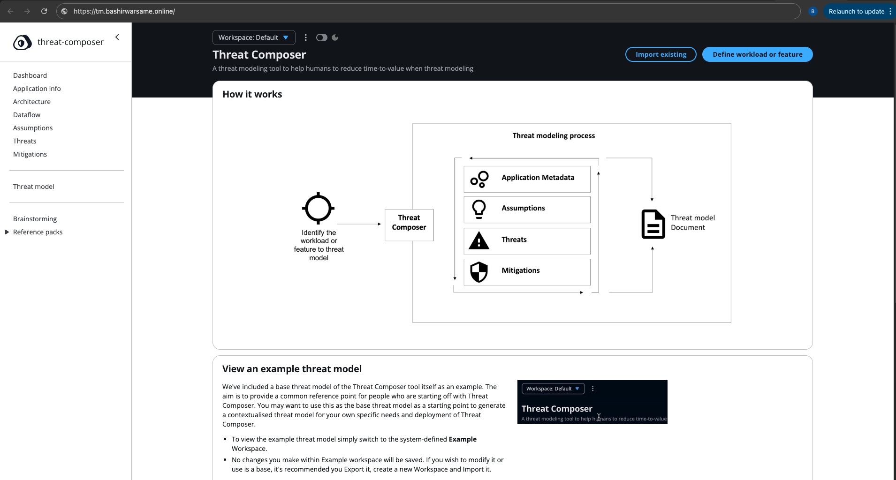
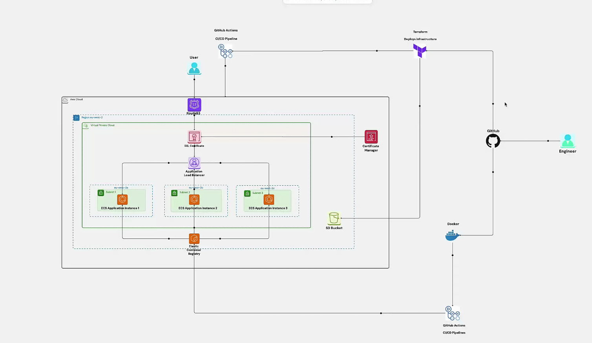
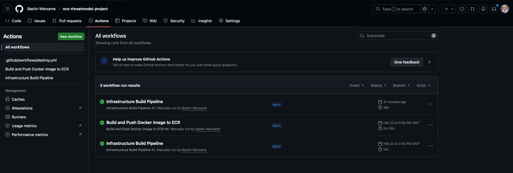

# Production-Ready AWS Threat Modelling App Deployment to AWS ECS with Terraform & GitHub Actions

This project demonstrates a production-style deployment of a containerized Node.js application on AWS ECS using Infrastructure as Code (Terraform) and CI/CD automation (GitHub Actions). 
The setup is designed to be simple, repeatable, and scalable, removing the need for manual steps in the AWS Console. The app is securely hosted on AWS with a custom subdomain (bashirwarsame.online) managed through Amazon Route 53.



It provisions a secure, scalable, HTTPS-enabled architecture using:

* **Amazon ECS (Fargate)**
* **Application Load Balancer (ALB)**
* **Amazon ECR**
* **AWS ACM**
* **Route 53**
* **Terraform**
* **GitHub Actions**

---

# Architecture Overview



---

# Infrastructure Components

## Networking

* Custom VPC
* Public subnets across multiple AZs
* Security groups for ALB and ECS
* Internet-facing Application Load Balancer

## ⚖ Load Balancing

* HTTP (80) → Redirect to HTTPS (443)
* SSL termination via AWS ACM
* Health checks with configurable thresholds

## Compute

* ECS Cluster (Fargate launch type)
* Task Definition with CPU & memory configuration
* ECS Service with desired task count
* CloudWatch logging enabled

## Container Registry

* Amazon ECR repository
* Docker image tagged and versioned
* CI/CD image push automation

## Security

* IAM execution role with least privilege
* Security group isolation (ALB → ECS only)
* HTTPS enforced with ACM certificate

---

# CI/CD Pipeline

Automated via **GitHub Actions**:



### Workflow Steps

1. Build Docker image
2. Authenticate to Amazon ECR
3. Push image to ECR
4. Terraform init
5. Terraform plan
6. Terraform apply

Ensures infrastructure and application updates are automated and reproducible.

---

# ⚙️ Key Terraform Modules

* VPC & Networking
* ALB & Target Group
* ECS Cluster & Service
* IAM Roles
* Route 53 Records
* ACM Certificate

Modular structure allows separation of concerns and reusable components.

---

# Deployment

### Initialize Terraform

```bash
terraform init
```

### Plan Infrastructure

```bash
terraform plan
```

### Apply Infrastructure

```bash
terraform apply
```

### Destroy Infrastructure

```bash
terraform destroy
```

---

# Observability

* ECS logs streamed to CloudWatch
* ALB health checks configured
* ECS service maintains desired task count
* Health-based routing via Target Groups

---

# Engineering Challenges Solved

This project involved debugging and resolving:

* Region mismatch between ECS, ACM, and ECR
* 403 image pull errors from incorrect ECR URI
* ALB 503 errors due to unhealthy targets
* Port mismatches between container and target group
* IAM execution role misconfiguration

These issues strengthened understanding of:

* AWS regional resource scoping
* ECS task lifecycle
* ALB health check behavior
* ECR authentication
* Terraform dependency ordering

---

# What This Project Demonstrates

* Infrastructure as Code (IaC) best practices
* Secure containerized deployments
* Production-grade HTTPS configuration
* CI/CD automation
* Cloud debugging & incident resolution
* AWS networking fundamentals
* Service-to-service permission modeling (IAM)

---

# Technologies Used

* Terraform
* Docker
* Amazon ECS (Fargate)
* Amazon ECR
* Application Load Balancer
* AWS ACM
* Route 53
* GitHub Actions
* CloudWatch

---

# Author

**Bashir Warsame**

Cloud & DevOps Engineer

---